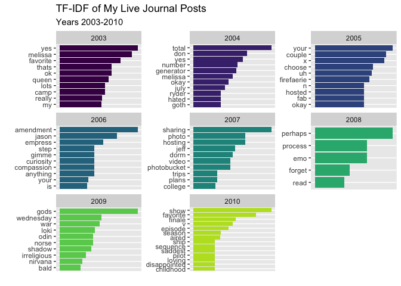
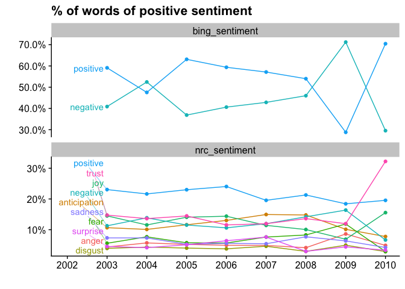
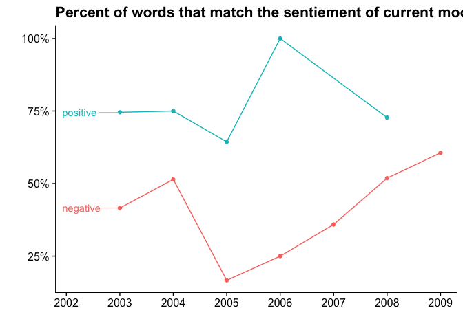

``` r
library(tidyverse)
```

    ## ── Attaching packages ─────────────────────────────────────── tidyverse 1.3.0 ──

    ## ✓ ggplot2 3.3.3     ✓ purrr   0.3.4
    ## ✓ tibble  3.1.0     ✓ dplyr   1.0.5
    ## ✓ tidyr   1.1.3     ✓ stringr 1.4.0
    ## ✓ readr   1.4.0     ✓ forcats 0.5.1

    ## ── Conflicts ────────────────────────────────────────── tidyverse_conflicts() ──
    ## x dplyr::filter() masks stats::filter()
    ## x dplyr::lag()    masks stats::lag()

``` r
library(lubridate)
```

    ## 
    ## Attaching package: 'lubridate'

    ## The following objects are masked from 'package:base':
    ## 
    ##     date, intersect, setdiff, union

``` r
library(tidytext)
library(hunspell)
library(ggrepel)
library(cowplot)
```

    ## 
    ## Attaching package: 'cowplot'

    ## The following object is masked from 'package:lubridate':
    ## 
    ##     stamp

``` r
library(ggrepel)
```

I downloaded all my past Live Journal entieries to a folder in on my
desktop in the same format, so that I could easily load them in for
analysis.

``` r
lj_files <- list.files("~/github/LJ/", pattern = "stumpthegreat", full.names = TRUE)

lj_df <- map_dfr(lj_files, read_csv, col_types = cols(
  itemid = col_character(),
  eventtime = col_character(),
  logtime = col_character(),
  subject = col_character(),
  event = col_character(),
  security = col_character(),
  allowmask = col_character(),
  current_music = col_character(),
  current_mood = col_character() )
) %>%
  distinct()
```

The next step is to take every jounral and seperate out the indiviual
words using ‘tidytext.’

``` r
lj_words <- lj_df %>%
  select(itemid, eventtime, logtime, subject, current_music, current_mood, event) %>%
  mutate(across(c(eventtime, logtime), ymd_hms),
         year = year(logtime),
         month = month(logtime),
         ) %>%
  unnest_tokens(word, event, format = "html", strip_url = TRUE) 
```

I was (and continue to be) terrible at spelling words correctly and also
terrible at checking what I’ve typed after the fact. I use ‘hunspell’
here in an attempt to fix some of the most common issues.

``` r
lj_words_spell_check <- lj_words %>%
  anti_join(stop_words, by = "word") %>%
  count(word) %>%
  rowwise() %>%
  mutate(spell_check = hunspell(word, ignore = words_not_in_dic)) %>%
  filter(length(spell_check) == 1) %>%
  mutate(suggest = hunspell_suggest(spell_check))

lj_correct <- lj_words_spell_check %>%
  filter(length(suggest) > 0) %>%
  mutate(suggest_pick = pluck(suggest, 1)) %>%
  unnest(suggest_pick) %>%
  select(word, suggest = suggest_pick) %>%
  bind_rows(tibble(word  = c("don"), 
                   suggest = c("don't") 
                   )
            ) 

lj_words_corrected <- lj_words %>%
  left_join(lj_correct, by = "word") %>%
  mutate(word = coalesce(suggest, word)) %>%
  unnest_tokens(output = "word", input = word)
```

``` r
lj_words_corrected %>%
  count(year, word) %>% 
  tidytext::bind_tf_idf(word, year, n) %>%
  group_by(year) %>%
  top_n(n = 10, wt = tf_idf) %>%
  ungroup() %>%
  filter(n >= 2) %>%
  ggplot(aes(x = tf_idf, y = reorder_within(word, by = tf_idf, within = year), 
             fill = factor(year)) ) +
  geom_col() +
  scale_y_reordered() +
  guides(fill = FALSE) +
  viridis::scale_fill_viridis(discrete = TRUE, end = 0.9, option = "D") +
  scale_x_continuous(breaks = NULL) +
  facet_wrap(~year, scales = "free") +
  labs(x = "", 
       y = "",
       title = "TF-IDF of My Live Journal Posts",
       subtitle = "Years 2003-2010")
```



``` r
df_plot <- lj_words_corrected %>%
  left_join (get_sentiments("bing") ) %>%
  rename(bing_sentiment = sentiment) %>%
  left_join (get_sentiments("nrc") ) %>%
  rename(nrc_sentiment = sentiment) %>%
  pivot_longer(cols = c(bing_sentiment, nrc_sentiment), 
               names_to = "sentiment_type", values_to = "sentiment") %>%
  count(sentiment_type, year, sentiment) %>%
  filter(! is.na(sentiment) ) %>%
  rename(count = n ) %>%
  group_by(sentiment_type, year) %>%
  mutate(total = sum(count)) %>%
  ungroup() %>%
  mutate(percent = count / total,
         year_month = ymd(str_c(year, "01", "01", sep = "-"))
         ) 
```

    ## Joining, by = "word"
    ## Joining, by = "word"

``` r
df_plot %>%
  ggplot(aes(x = year_month, y = percent, color = sentiment, label = sentiment)) +
  geom_line() +
  geom_point() +
  geom_text_repel(
    data = filter(df_plot, min(year_month) == year_month),
    nudge_x      = -1,
    direction    = "y",
    hjust        = 1,
    segment.size = 0.2,
    xlim = c(-Inf, ymd("2002-12-01") )
  ) +
  scale_y_continuous(label = scales::percent) +
  scale_x_date(breaks = scales::pretty_breaks(12), 
               expand = expansion(mult = c(0.20, 0.05)),
               ) +
  guides(color = FALSE) +
  labs(x = "", y = "", title = "% of words of positive sentiment") +
  facet_wrap(~sentiment_type, scales = "free_y", nrow = 2) +
  cowplot::theme_cowplot()
```



``` r
extra_sentiemnt <- tibble::tribble(
       ~word, ~sentiment,
            "amused",  "positive",
             "blank",  "negative", 
              "busy",  "negative",
     "contemplative",  "negative",
     "indescribable",  "negative",
            "mellow",  "negative",
              "okay",  "positive",
            "pissed",  "negative",
               "off",  "negative",
          "stressed",  "negative",
           "working",  "negative",
           "content",  "positive"
     )

lj_words_corrected %>%
  left_join (get_sentiments("bing") ) %>%
  separate_rows(current_mood) %>%
  left_join ( bind_rows(get_sentiments("bing"), extra_sentiemnt), by = c("current_mood" = "word") ) %>%
  rename(mood_sentiment = sentiment.y) %>%
  filter(! is.na(sentiment.x), ! is.na(mood_sentiment)) %>%
  group_by(year, mood_sentiment) %>%
  summarise(percent = sum(mood_sentiment == sentiment.x, na.rm = TRUE) / n() ) %>%
  ungroup()  -> df_plot
```

    ## Joining, by = "word"

    ## `summarise()` has grouped output by 'year'. You can override using the `.groups` argument.

``` r
  ggplot(df_plot, aes(x = year, y = percent, color = mood_sentiment, label = mood_sentiment)) +
  geom_line() +
  geom_point() +
  geom_text_repel(
        data = filter(df_plot, min(year) == year),
        nudge_x      = -1,
        direction    = "y",
        hjust        = 1,
        segment.size = 0.2) +
  scale_y_continuous(label = scales::percent) +
  scale_x_continuous(breaks = scales::pretty_breaks(7),
               expand = expansion(mult = c(0.20, 0.05)),
               ) +
  guides(color = FALSE) +
  labs(x = "", y = "", title = "Percent of words that match the sentiement of current mood") +
  cowplot::theme_cowplot()
```



``` r
lj_words_corrected %>%
  distinct(itemid, current_music) %>%
  count(current_music, sort = TRUE)
```

    ## # A tibble: 35 x 2
    ##    current_music                                    n
    ##    <chr>                                        <int>
    ##  1  <NA>                                           99
    ##  2 "I want to break free- queen"                    2
    ##  3 "'Willkommen\" -caberet"                         1
    ##  4 "\"All I Ask Of You\" -Phantom of teh Opera"     1
    ##  5 "\"Hey G-d\" Bon Jovi"                           1
    ##  6 "\"Within You\" by David Bowie"                  1
    ##  7 "30/90 Tick Tick...Boom"                         1
    ##  8 "AIDA"                                           1
    ##  9 "Bo Rhap -Queen"                                 1
    ## 10 "Harry Potter Theme"                             1
    ## # … with 25 more rows
